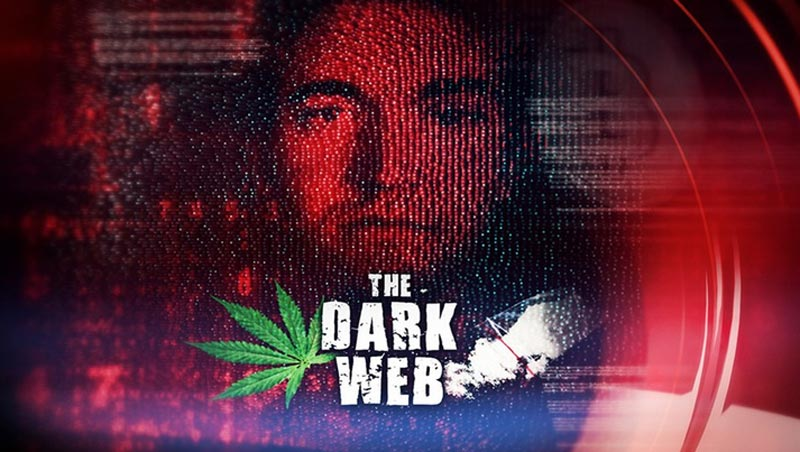
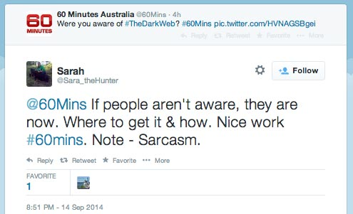

60 Minutes Australia tonight [aired a story](http://www.jump-in.com.au/show/60minutes/stories/2014/september/the-dark-web/) about Silk Road and Bitcoin. The video of the report, which is 14 minutes long, is [now available on their website](http://www.jump-in.com.au/show/60minutes/videos/3784171895001/) or [mirrored here on DailyMotion](http://www.dailymotion.com/video/x25y1be_60-minutes-australia-silk-road-and-bitcoin-story-september-2014_news).

The story is about what you would expect from a major media current affairs program. It shows “Sarah”, an Australian drug user who says she purchases her drugs online because it is less stressful, safer and anonymous (Sarah is also saying all of this, along with tips on how to buy drugs – such as reading reviews on the forums prior to purchasing, and using a fake name to receive your order – while on national television).

The report is intertwined with the [story of Preston Bridge](http://www.abc.net.au/news/2014-06-09/perth-teenager-preston-bridge/5510606), a teenager who died after falling (or jumping) from the balcony after taking [NBOMe](http://en.wikipedia.org/wiki/25I-NBOMe), a synthetic form of LSD, that another person at the party had purchased from Silk Road. Also part of the report is an interview with FBI agent Christopher Tarbell – who was part of the investigation into Silk Road, which lead to the arrest of Ross Ulbricht. Tarbell is most infamous as the handler of Lulzsec hacker Sabu ([Hector Monsegur](http://en.wikipedia.org/wiki/Hector_Xavier_Monsegur)) and an author of the technical report released last week about [how the FBI located the Silk Road server](https://www.nikcub.me/posts/analyzing-fbi-explanation-silk-road/).

### Deepweb or Darknet

What was more interesting to me about the story was how the terms “Deepweb” and “Darknet” were used interchangeably, and how the report spent some time describing how “most of the Internet” is hidden from ordinary web users.

The reporter says in the introduction:

> [Reporter] “whatever device you’re using, you’ve got the whole world at your fingertips. Well, no you don’t. In fact, you have access to less than 10% of it. The other 90% of the Internet is hidden – a vast, secret, cyber underworld. It’s called the Darkweb – and people aren’t using it to buy shoes. They’re buying drugs, weapons – anything you can imagine. The subterranean world is sinister and untraceable – with consequences that can be deadly. “

And then in the story:

> [Reporter] “What many don’t realize is that if you’re using a search engine, like Google or Yahoo, you’re only scratching the surface of the Internet. Below is a mass of hidden content, more than 90% of the Internet – knows as the Deep, or Dark web. With the right software it is easily accessible, and it is here that the new breed of drug dealers are selling their wares”

First, there is an irony in this because if we go back to the beginning of the report, where Sarah was demonstrating Silk Road, the tab in her browser next to the tab showing Silk Road is a Google search results page for “list of tor sites silkroad”:

If you [do the same search](https://encrypted.google.com/search?q=list+of+tor+sites+silkroad), you’ll find that the onion URL for Silk Road is in the top result. Darknet sites are only not indexed directly by Google because Google has chosen not to index them. DuckDuckGo, an alternate search engine, have considered indexing onion sites directly but decided not to as it would “tick some people off” (namely, the site administrators). There are also web services that proxy Darknet websites hosted as onion hidden services on Tor and make them accessible over the clearnet. [Tor2web](http://www.tor2web.org) is just one example, and the pages it hosts can sometime be found in the indexes of search engines (Note: do not use Tor2web to signup to any accounts on hidden services or enter your password anywhere – it breaks the security model of Tor, while it is useful if you ned to browse and read and don’t have Tor – you do lose your anonymity).

Clearly Darknet sites are not very “hidden”, and they do not make up “90% of the web” (far from it, there would be hundreds or thousands of Darknet sites, while there are tens of millions clearnet sites) – what is going on here is reporters and other sources mix up the terms “Deepweb” and “Darkweb”. This report is just the latest example of that mistake being made.

Interchanging “Deepweb” with “Darknet” or “Darkweb” is common, but they are two distinct concepts. The concept of the Deepweb was first described as the _Hidden Web_ in a 1994 book titled [“The Internet Business Book”](http://dl.acm.org/citation.cfm?id=185247) by Dr Jill Ellsworth and Matthew Ellsworth. The author describes the concept in [this 1996 interview](http://web.archive.org/web/19961205083117/http://tcp.ca/Jan96/BusandMark.html):

> signs of an unsuccessful or poor site are easily identified, says Ellsworth. “Without picking on any particular sites, I’ll give you a couple of characteristics. It would be a site that’s possibly reasonably designed, but they didn’t bother to register it with any of the search engines. So, no one can find them! You’re hidden. I call that the invisible Web.”

The hidden web concept was cited, expanded on and re-termed the Deepweb in a 2001 paper titled [“The Deep Web: Surfacing Hidden Value”](http://quod.lib.umich.edu/j/jep/3336451.0007.104?view=text;rgn=main) by Michael Bergman. Most statistics about the deepweb, such as the oft-cited “90% of the web is hidden” figure, are from this 13 year old paper.

Deepweb describes websites and pages that are not accessible by search engine crawlers, and are thus not indexed or readily discovered by web surfers. The deepweb is information that is stored and can be retrieved on private networks or on networks that are connected to the public internet but are only accessible with a user account. It is all that information stored by companies, government agencies or other organizations and used internally but not made available to the public.

It is true that the _Deepweb_ makes up some large amount of information and data that is larger than what is available on the public web – the figure may even be ten times larger – but this is very distinct from the Darknet, which is Tor (or i2p, or another protocol and network) hosted sites.

The _Darknet_, which this story is about, is not 90% of the Internet nor is it large and very hidden.

### Reactions from Viewers

The story on 60 Minutes, which is a popular weekly current affairs program, provoked reactions on Twitter and other social media. The first tweet from the official program Twitter [account was “Are you aware of the Darkweb?”](https://twitter.com/60Mins/status/511102393665069056) – to which many replied a variation of “we are now”, which speaks to the [Streisand effect](http://en.wikipedia.org/wiki/Streisand_effect) of reporting on topics that were previously more obscure.

Other reactions include a call to have such sites blocked, which suggests the story didn’t do a good job of explaining just where and how these sites are hosted (outside of them being “hidden”) while others ask how children are able to access and “afford” such software.

